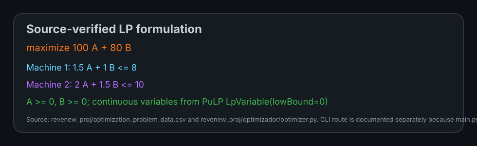
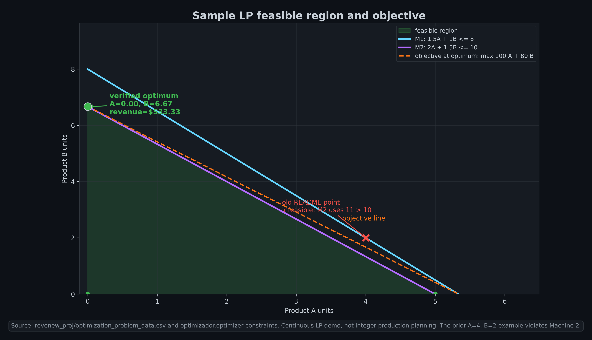

# Revenue Optimization App

Educational Django + PuLP demo for a two-product linear-programming problem. A user uploads one CSV row with machine times, available machine hours, and product prices; the app solves the continuous LP and displays the result.

Current maturity: small teaching/demo app. The checked-in CI workflow covers architecture and Django tests, the CLI route below is now exercised locally, and the model is continuous LP rather than integer production planning.

## Source-verified LP example

The checked-in sample CSV is `revenew_proj/optimization_problem_data.csv`. The optimizer source in `revenew_proj/optimizador/optimizer.py` builds:



```text
maximize    100 A + 80 B
subject to  1.5 A + 1.0 B <= 8      (Machine 1)
            2.0 A + 1.5 B <= 10     (Machine 2)
            A >= 0, B >= 0
```

The old README example A = 4, B = 2, revenue = $560 was mathematically infeasible because Machine 2 would use \(2\cdot4 + 1.5\cdot2 = 11\) hours, above the 10 hour cap.

Correct continuous-LP optimum for the checked-in sample:

```yaml
Optimization status: Optimal
Product A: 0.00
Product B: 6.67
Total Revenue: $533.33
```



Visual provenance: generated with `uv run --python 3.13 --with matplotlib==3.10.3 --with numpy==2.2.6 python docs/scripts/generate_lp_readme_visual.py` from `revenew_proj/optimization_problem_data.csv` and the same constraint form used by `OptimizationModel`. See `docs/assets/lp_feasible_region_sample_provenance.json` for hashes, vertices, and infeasibility details for the old example.

## Tech stack

- Python 3.10+ expected by Django 5.2; Python 3.13 was used for README visual generation.
- Django 5.2.4, as pinned in `requirements.txt` and confirmed by `revenew_proj/revenew_proj/settings.py`.
- PuLP for the LP model.
- pandas for CSV loading and validation.
- matplotlib for result plots.
- Bootstrap templates for the web UI.

## Installation

```bash
git clone <your-repo-url>
cd django-optimization-app

python -m venv rvn_venv
source rvn_venv/bin/activate  # macOS/Linux
# Windows PowerShell: .\rvn_venv\Scripts\Activate.ps1

pip install -r requirements.txt
```

Note: this repository's `requirements.txt` is plain text in the current clone. If a future tool reports an encoding error, verify the file before assuming the documented commands are broken.

## Run the web app

`manage.py` lives under `revenew_proj/`, so run Django commands from that directory:

```bash
cd revenew_proj
python manage.py runserver
```

Then open:

```text
http://127.0.0.1:8000/optimizador/
```

You can upload `revenew_proj/optimization_problem_data.csv` or another one-row CSV matching the schema below.

## Run tests

The maintained verification route has three parts: the Django unittest suite, the
pytest-based architecture suite, and the dependency-free architecture checker.

```bash
cd revenew_proj
DJANGO_SECRET_KEY=*** uv run --with-requirements ../requirements.txt python manage.py test optimizador.tests
cd ..
uv run --with pytest python -m pytest tests/architecture
python scripts/check_portfolio_architecture.py
```

The GitHub Actions workflow at `.github/workflows/portfolio-architecture.yml`
runs the same checker, installs the app/test dependencies, runs
`python -m pytest tests/architecture`, then runs the Django app tests.

## Command-line route status

Verified locally in this refresh:

```bash
cd revenew_proj
DJANGO_SECRET_KEY=*** uv run --with-requirements ../requirements.txt python main.py optimization_problem_data.csv
```

Expected output for the checked-in sample:

```text
Optimization status: Optimal
Product A: 0.0
Product B: 6.67
Total Revenue: $533.33
```

The root-level command from the old README was path-wrong because there is no root `manage.py` or root `main.py`.

## CSV format example

| Product_A_Production_Time_Machine_1 | Product_B_Production_Time_Machine_1 | Machine_1_Available_Hours | Product_A_Production_Time_Machine_2 | Product_B_Production_Time_Machine_2 | Machine_2_Available_Hours | Price_Product_A | Price_Product_B |
|-------------------------------------|-------------------------------------|----------------------------|-------------------------------------|-------------------------------------|----------------------------|------------------|------------------|
| 1.5                                 | 1.0                                 | 8                          | 2.0                                 | 1.5                                 | 10                         | 100              | 80               |

Validation rules enforced by `DataLoader`:

- all required columns are present;
- all required values are numeric;
- all required values are non-negative;
- the input contains exactly one row.

## Rebuild README visuals

```bash
uv run --python 3.13 \
  --with matplotlib==3.10.3 \
  --with numpy==2.2.6 \
  python docs/scripts/generate_lp_readme_visual.py
```

Generated/updated assets:

- `docs/assets/lp_feasible_region_sample_dark.png`
- `docs/assets/lp_formulation_card_dark.svg`
- `docs/assets/lp_feasible_region_sample_provenance.json`

## Limitations

- Continuous variables: no integer-production, setup-cost, demand, inventory, or multi-period constraints.
- Single-row CSV contract only.
- No authentication or production deployment hardening.
- CI covers the portfolio architecture checker, architecture pytest suite, and Django app tests.
- CLI route is exercised by the documented command above and currently solves the checked-in sample CSV.
